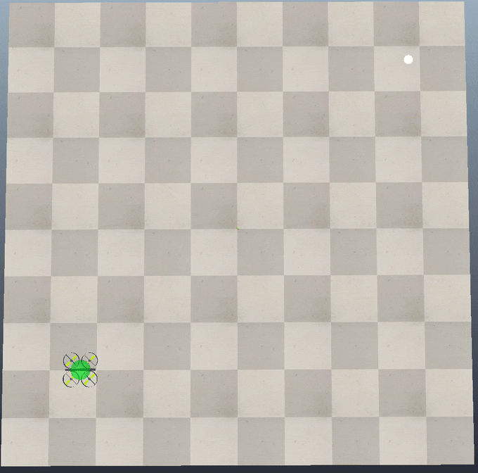
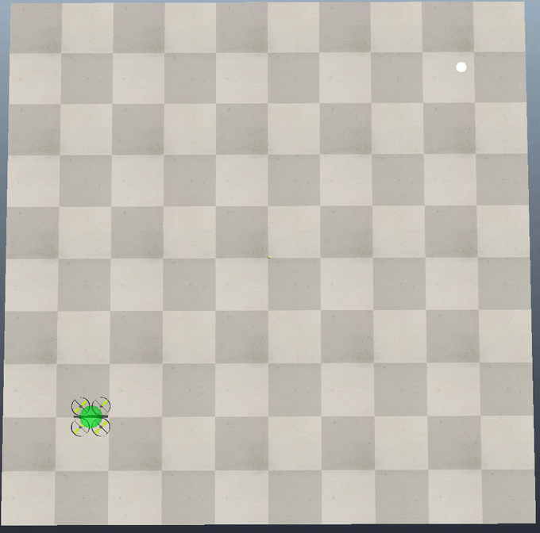

# Basic Motion Planning

---

## Project Objectives
- What is a C-Space? 
- What is it for a car? What is `SO(3)`? 
- how to compute distances in `SO(3)`? 
- What is homeomorphism? What are some examples for homemorphic and non-homemorphic subspaces? 
- Follow a geometric path from D* algorithm from [Dstar-Pathfinding-Simulations](https://github.com/scalemailted/dStar-Pathfinding-Simuations) project using a quadcopter (UAV).

---

## Motivations
This project covers fundamental concepts for motion planning orientation and trajectory. It bridges the gap from path planning to motion planning, beginning with C-space and its applications. The use of special orthogonal groups, including `SO(3)`, is explored to compare orientations and differentiate motion planning from path planning. Homeomorphism is introduced to explain the mapping between geometric space and C-space. Finally, a practical, applicable examples of motion planning is provided in CoppeliaSim.

---

## Approach

This motion planning project is broken into two components: theoretical and applicable.

### Theoretical Motion Planning
This component focuses on providing a student guide that details the fundamental and foundational concepts requiref to understand what motion planning is, how it differs from path planning, and eastablish the necessary a mathematical models to realize it. 

### Applicable Motion Planning
This component uses the mathematical concepts in practice to implement a motion planning trajectory for a quadcopter in both a very simple case, and where orientation matters. 

---

## Key Features

- **Theoretical**
    + C-space
    + SO(3)
    + Quaternion
    + Homeomorphism

- **Applicable**
    + Trajectory Considerations
    + Orientation Considerations
    + CoppeliaSim Robotic Simulator

---

## Algorithmic Overview:

### Simple Motion Planning
The main steps of the algorithm can be summarized as follows:

1. **Import necessary libraries:** The script imports the required libraries, such as numpy, for handling mathematical operations.

2. **Set maximum velocity and acceleration:** The maximum velocity and acceleration for the quadcopter are defined as global variables.

3. **Define the `sysCall_thread()` function:** This function is responsible for executing the main algorithm, including reading the path data, updating the quadcopter's position, and controlling the simulation time step.

    1. **Enable automatic thread switching:** This ensures that the simulation can continue to run while the script is executing.

    2. **Get the goal object:** The target object (goal) in the simulation is retrieved.

    3. **Calculate the time step:** The simulation time step is multiplied by 2.0 and stored in the dt variable.

    4. **Main loop:** The algorithm runs in a continuous loop, performing the following steps:

        1. **Retrieve the path handle:** The path handle is fetched from a signal sent by another script, and the signal is cleared.

        2. **Read path data:** The path data is read from the path handle, using the custom data block 'PATH', and unpacked into a list.

        3. **Convert path data to a matrix**: The path list is reshaped into a matrix using numpy, where each row represents a point in the path.

### Orientation Motion Planning
The motion planning script with forward orientation provided in the Applicable Motion Planning component is responsible for guiding a quadcopter along a path generated by the D* pathfinding algorithm, while maintaining the forward orientation of the quadcopter. The main steps of the algorithm can be summarized as follows:

1. **Import necessary libraries:** The script imports the required libraries, such as numpy and math, for handling mathematical operations.

2. **Set maximum velocity and acceleration:** The maximum velocity and acceleration for the quadcopter are defined as global variables.

3. **Define the `sysCall_thread()` function:** This function is responsible for executing the main algorithm, including reading the path data, updating the quadcopter's position and orientation, and controlling the simulation time step.

    1. **Enable automatic thread switching:** This ensures that the simulation can continue to run while the script is executing.

    2. **Get the goal object:** The target object (goal) in the simulation is retrieved.

    3. **Calculate the time step:** The simulation time step is multiplied by 2.0 and stored in the dt variable.

    4. **Main loop**: The algorithm runs in a continuous loop, performing the following steps:

        1. **Retrieve the path handle:** The path handle is fetched from a signal sent by another script, and the signal is cleared.

        2. **Read path data:** The path data is read from the path handle, using the custom data block 'PATH', and unpacked into a list.

        3. **Convert path data to a matrix**: The path list is reshaped into a matrix using numpy, where each row represents a point in the path.
    
    5. **Define the calculate_orientation() function**:** This function takes two points (p1 and p2) as input and calculates the yaw angle between them, assuming the quadcopter moves on a 2D plane (X, Y) with a fixed Z-axis orientation.

The orientation motion planning algorithm described above provides a way to guide a quadcopter through a given path while maintaining the forward orientation of the quadcopter, ensuring that it always faces the direction of its next target pose.

---

## Implementation: 

### *Theory*
- [**Basics of Motion Planning: Student Guide** *PDF*](https://github.com/scalemailted/Basic-Motion-Planning/blob/main/documents/pdf/basics-motion-planning.pdf)

### *CoppeliaSim* 

**simple-motion-planning.ttt**
> Motion Planning with no regard to orientation

**orientation-motion-planning.ttt**
> Motion Planning with forward orientation

---

## Project Hierarchy 
- 📁 **assets/**
    >*contains all images in readme documentation*
- 📁 **coppeliasim/**
    + 📁 **scenes/**
        >*contains CoppeliaSim scenes*
        - 📄 simple-motion-planning.ttt
        - 📄 orientation-motion-planning.ttt
    + 📁 **scripts/**
        >*contains associated Python scripts from the scene*
        - 📄 dstar_path.py
            >*dstar path planning algorithm*
        - 📄 simple_motion_planner.py
            >*motion planning algorithm with no regard to orientation*
        - 📄 orientation_motion_planner.py
            >*motion planning algorithm with forward orientation*